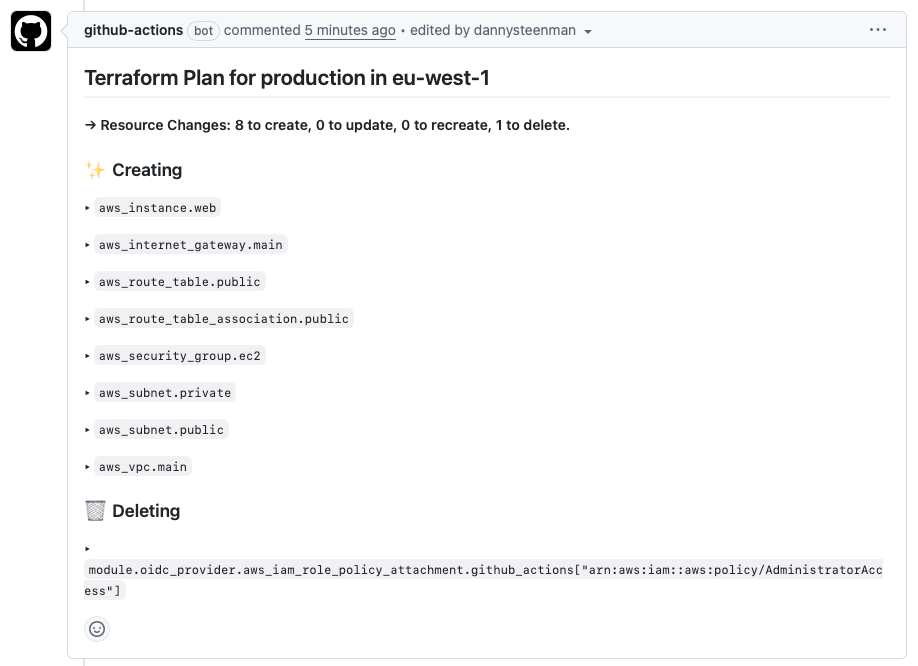

# Terraform Plan PR Commenter

A GitHub Action that posts the output of `terraform plan` as a comment on Pull Requests. This action helps teams review infrastructure changes directly within their PR workflow, making it easier to catch potential issues before applying Terraform changes.



## Features

- Automatically posts formatted Terraform plan output to PR comments
- Updates existing comments instead of creating duplicates
- Optionally skips posting when there are no changes
- Supports custom headers for better organization in multi-environment setups
- Works with binary plan files for accurate change detection
- This GitHub Action is developed using native JavaScript, so it executes way faster compared to an action build using Docker.

<!-- TIP-LIST:START -->
> [!TIP]
> **Want even better PR insights? See exactly how your infrastructure changes impact AWS costs.**
>
> [CloudBurn](https://cloudburn.io) is a GitHub App that automatically analyzes your Terraform plans and posts cost impact comments in your PRs. No more discovering expensive decisions weeks later on your AWS bill when changes require production downtime and cross-team coordination.
>
> <a href="https://github.com/marketplace/cloudburn-io"></a>
>
> <details>
> <summary>💰 <strong>How it works</strong></summary>
> <br/>
>
> 1. **Keep using this action** – It posts your Terraform plan to PRs
> 2. **Install CloudBurn** – [One-click install from GitHub Marketplace](https://github.com/marketplace/cloudburn-io)
> 3. **Get automatic cost analysis** – CloudBurn analyzes the plan and adds cost impact comments to every PR
>
> **What you get:**
> - Automatic cost analysis on every PR with infrastructure changes, showing monthly cost deltas
> - Real-time AWS pricing based on your infrastructure's region using live AWS Pricing API data
> - Detailed breakdowns showing old vs. new monthly costs per resource with usage types and pricing details
> - Free Community plan: 1 repository + unlimited users (perfect for individual developers and open-source projects)
>
> </details>
<!-- TIP-LIST:END -->

## Inputs

| Input               | Description                                                                         | Required | Default               |
| ------------------- | ----------------------------------------------------------------------------------- | -------- | --------------------- |
| `planfile`          | Path to the Terraform plan file to post as comment in the Pull Request              | Yes      | -                     |
| `terraform-cmd`     | Command to execute for calling the Terraform binary                                 | No       | `terraform`           |
| `working-directory` | Directory where the Terraform binary should be called                               | No       | `.`                   |
| `token`             | The GitHub or PAT token to use for posting comments to Pull Requests                | No       | `${{ github.token }}` |
| `header`            | Header to use for the Pull Request comment                                          | No       | -                     |
| `aws-region`        | The AWS region where the infrastructure changes are being applied (e.g., us-east-1) | No       | -                     |

## Outputs

| Output     | Description                                                        |
| ---------- | ------------------------------------------------------------------ |
| `markdown` | The raw markdown output of the `terraform plan` command            |
| `empty`    | Whether the `terraform plan` contains any changes (`true`/`false`) |

## Usage

### Example 1: Direct Usage in Workflow

```yaml
name: Terraform Plan and Comment on PR

on:
  pull_request:
    branches:
      - main

permissions:
  pull-requests: write
  contents: read

jobs:
  plan-and-comment:
    name: Run Terraform Plan and Post PR Comment
    runs-on: ubuntu-latest

    steps:
      - name: Checkout Repository
        uses: actions/checkout@v5

      - name: Setup Terraform
        uses: hashicorp/setup-terraform@v3

      - name: Terraform Init
        run: terraform init

      - name: Terraform Plan
        run: terraform plan -out=tfplan.binary

      # Add this action to your workflow ↓
      - name: Post Terraform Plan Comment in PR
        uses: towardsthecloud/terraform-plan-pr-commenter@v1
        with:
          planfile: tfplan.binary
          aws-region: us-east-1
```

### Example 2: Reusable Workflow Call

Create a reusable workflow in `.github/workflows/terraform-plan-comment.yml`:

```yaml
name: Reusable Terraform Plan PR Comment

on:
  workflow_call:
    inputs:
      planfile:
        description: 'Path to the Terraform plan file'
        type: string
        required: true
      working-directory:
        description: 'Terraform working directory'
        type: string
        required: true
      aws-region:
        description: 'AWS Region where resources will be deployed'
        type: string

jobs:
  comment-terraform-plan:
    name: Post Terraform Plan as PR Comment
    runs-on: ubuntu-latest
    permissions:
      pull-requests: write
      contents: read

    steps:
      - name: Checkout Repository
        uses: actions/checkout@v5

      - name: Download Plan Artifact
        uses: actions/download-artifact@v5
        with:
          name: terraform-plan-artifact
          path: ${{ inputs.working-directory }}

      - name: Setup Terraform
        uses: hashicorp/setup-terraform@v3

      - name: Terraform Init
        run: terraform init -backend=false
        working-directory: ${{ inputs.working-directory }}

      # Add this action to your workflow ↓
      - name: Post Terraform Plan Comment in PR
        uses: towardsthecloud/terraform-plan-pr-commenter@v1
        with:
          planfile: ${{ inputs.planfile }}
          working-directory: ${{ inputs.working-directory }}
          aws-region: ${{ inputs.aws-region }}
```

Then call this workflow from your main Terraform workflow:

```yaml
name: Terraform Plan with Artifact Upload

on:
  pull_request:
    branches:
      - main

jobs:
  plan-infrastructure:
    name: Generate and Upload Terraform Plan
    runs-on: ubuntu-latest

    steps:
      - name: Checkout Repository
        uses: actions/checkout@v5

      - name: Setup Terraform
        uses: hashicorp/setup-terraform@v3

      - name: Terraform Init
        run: terraform init
        working-directory: ./infrastructure

      - name: Terraform Plan
        run: terraform plan -out=tfplan.binary
        working-directory: ./infrastructure

      - name: Upload Plan Artifact
        uses: actions/upload-artifact@v5
        with:
          name: terraform-plan-artifact
          path: ./infrastructure/tfplan.binary
          retention-days: 1

  post-plan-comment:
    needs: plan-infrastructure
    uses: ./.github/workflows/terraform-plan-comment.yml
    with:
      planfile: tfplan.binary
      working-directory: ./infrastructure
      aws-region: us-east-1
```

Want to test this out first? Check out the [AWS Terraform Starter Kit](https://github.com/towardsthecloud/aws-terraform-starter-kit) we created. It's a production-ready Terraform template that has a GitHub workflow already configured to use this GitHub Action.

## Permissions

This action requires the following permissions:

```yaml
permissions:
  pull-requests: write  # Required to post comments on PRs
  contents: read        # Required to read repository contents
```

## Documentation

For complete documentation, including advanced configuration options and integration with CloudBurn for cost analysis, visit:

[Full Documentation on CloudBurn.io](https://cloudburn.io/docs/terraform-plan-github-action)

## Author

Maintained by [Towards the Cloud](https://towardsthecloud.com)
